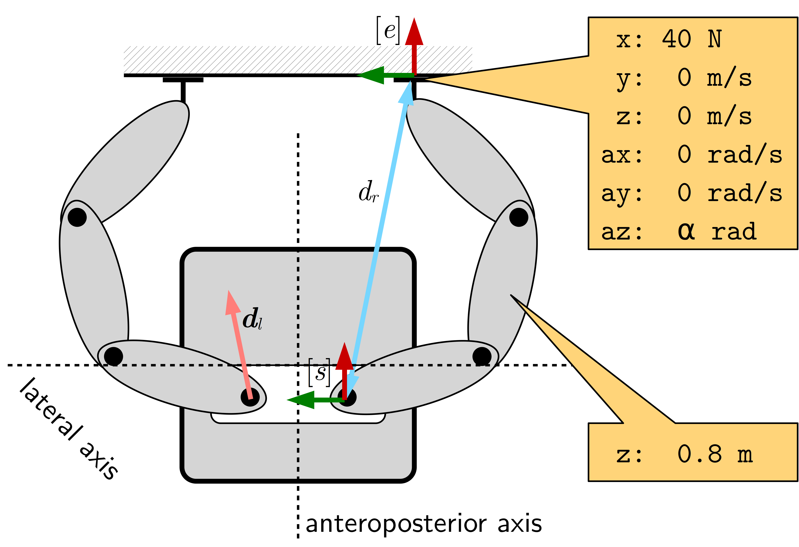
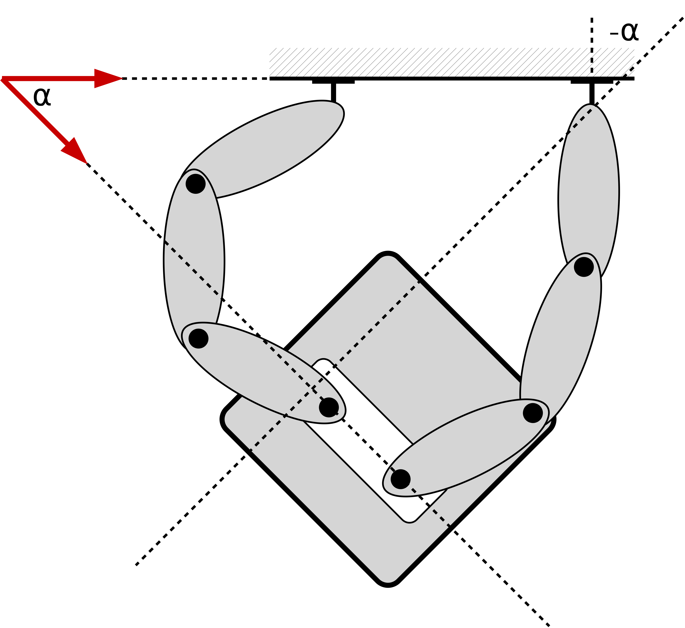

========
Tutorial
========

:numref:`fig_left` and :numref:`fig_right` show a complicated mobile robot with two torque-controlled 7-DoF arms performing an alignment to a table.

.. list-table:: Robot performing a sideways alignment to a table.

    * - .. _fig_left:
        .. figure:: _static/left.png

           Start configuration.

      - .. _fig_right:
        .. figure:: _static/centre.png

           Final configuration.

In this tutorial we describe the models that enable us to declaratively define that alignment behaviour as exemplified in :numref:`fig_task`.
We build upon our previous `tutorial <https://github.com/comp-rob2b/modelling-tutorial>`_ for defining composable robot models.
First, we demonstrate how to design the motion specification models for the right arm.
The models for the left arm are constructed in an analoguous way and are not detailed here.
Then, we explain the models for the overall alignment scenario that couple the specifications of both arms.

.. _fig_task:

  Top-down view of a schematic representation showing the robot in the aligned configuration.
  The top resembles the table, the bottom the robot's base while the ovals exemplify the manipulators' links.
  Additionally, the yellow boxes exemplify the motion specification associated with the right arm.
  The symbols :math:`[e]`, :math:`[s]`, :math:`d_r` and :math:`\vect{d}_l` represent the end-effector frame, the shoulder frame, the linear distance between both of these frames' origins and the direction from the shoulder to the end-effector, respectively.

To render model entities in the following text, we highlight them via this ``typographic convention``.

JSON-LD
=======

Just as in the previous tutorial we represent our models and metamodels with `JSON-LD <https://www.w3.org/TR/json-ld/>`_.
A core feature of JSON-LD is that it can indicate which keys in a JSON model are to be interpreted as symbolic pointers to other model entities.
Hence, JSON-LD models can form arbitrary graphs.
JSON-LD introduces several keywords that recur in the following models.
The ``@id`` property associates an identifier --- an Internationalized Resource Identifier (IRI) --- with each model entity.
One or more types (also IRIs) can be assigned to a model entity by using the ``@type`` property.
It may be uncommon to find full IRIs in JSON models.
To this end, JSON-LD allows developers to define a mapping between (potentially shorter) names in JSON models and their full-fledged IRI counterparts.
Such information is provided via JSON-LD's ``@context``, a JSON object that defines the meaning of a model.
The context can be associated with each individual entity or hoisted so that it applies to multiple entities.
For the models in this tutorial, we opt for the latter option and assume that the appropriate contexts have been defined.

Single arm motion
=================

Motion specification
--------------------

We constrain the six end-effect dimensions (angular and linear) and the height of the elbow.
To this end, we rely on these seven equality constraints:

* In the anterior direction (towards the table) the robot should exert a force to keep contact with the table.
* In the lateral direction (left/right) and in the vertical/longitudinal direction (up/down) the robot should not move, i.e. keep its linear velocity at zero.
* Around the anteroposterior axis (in the frontal plane) and around the lateral axis (in the longitudinal plane) the robot should not move, i.e. keep its angular velocity at zero.
* Keep the position of the elbow at a given reference height.

All of these constraints are one-dimensional.
This fosters composability, because we can add or remove the constraints one by one.

The following excerpt shows a JSON-LD model of the second constraint, the motion in the lateral direction:

.. _lst:constraint:

.. code-block:: json
    :linenos:
    :caption: Example of an equality-constrained velocity.

    {
        "@id": "cstr-linvel-rightarm-shoulder-ee-lateral",
        "@type": [ "Constraint", "EqualityConstraint", "LinearVelocityConstraint" ],
        "quantity": "linvel-rightarm-shoulder-ee-lateral",
        "reference-value": "linvel-rightarm-shoulder-ee-lateral-ref"
    }

We see that a ``Constraint`` symbolically refers to a ``quantity`` that will be constrained.
An ``EqualityConstraint`` further points to a ``reference-value`` that the quantity eventually should take.
Finally, both of these properties must be linear velocities which is structurally imposed via the ``LinearVelocityConstraint`` type.
The remaining models are not shown in this tutorial, because they resemble the above constraint.

As a next step, these constraints are composed in a ``GuardedMotion`` specification.
They can enter as a pre-condition (via the ``when`` property), a per-condition (via the ``while`` property), or a post-condition (via the ``until`` property).
The pre- and post-conditions enable the sequencing of multiple motion specifications.
Since we only utilize a single motion specification here, we leave both of these conditions empty:

.. code-block:: json
    :linenos:
    :caption: A guarded motion composes a set of constraints.

    {
        "@id": "motion-rightarm",
        "@type": "GuardedMotion",
        "when": [],
        "while": [
            "cstr-frc-rightarm-ee-anteroposterior",
            "cstr-linvel-rightarm-shoulder-ee-vertical",
            "cstr-pos-rightarm-platform-elbow-height",
            "cstr-angvel-rightarm-shoulder-ee-anteroposterior",
            "cstr-angvel-rightarm-shoulder-ee-lateral",
            "cstr-linvel-rightarm-shoulder-ee-lateral"
        ],
        "until": []
    }

If all six dimensions of a frame are constrained by either velocities or forces such a model aligns with a specification in the task frame formalism (TFF).

Initial world model
-------------------

The model in :numref:`lst:constraint` symbolically points to two models of linear velocities.
These velocities are part of the world model.
Here, the world model only comprises models that are directly referenced by the motion specification, but omits geometric primitives or kinematic chain entities.

At first, an equality constraint requires a reference value, or a setpoint, :math:`v_{set}`.
For the lateral velocity no motion is desired.
Hence, this is the model of a velocity of zero metres per second:

.. code-block:: json
    :linenos:
    :caption: Model of a setpoint for the lateral velocity.

    {
        "@id": "linvel-rightarm-shoulder-ee-lateral-ref",
        "@type": [ "Quantity", "LinearVelocity" ],
        "quantity-kind": "LinearVelocity",
        "unit": "M-PER-SEC",
        "value": "0.0"
    }

Next, we require a model that represents the to-be-constrained quantity :math:`v`, another linear velocity measured in metres per second but without a concrete value.

.. _lst:linvel:

.. code-block:: json
    :linenos:
    :caption: Model of the "measured" lateral velocity.

    {
        "@id": "linvel-rightarm-shoulder-ee-lateral",
        "@type": [ "Quantity", "LinearVelocity" ],
        "quantity-kind": "LinearVelocity",
        "unit": "M-PER-SEC"
    }

In other words, that value must be determined at runtime.
It actually originates from a 3D twist, specifically the twist *(i)* ``of`` the end-effector; *(ii)* ``with-respect-to`` the shoulder; *(iii)* measured in the end-effector's ``reference-point``; and *(iv)* ``as-seen-by`` the end-effector's coordinate frame.

.. code-block:: json
    :linenos:
    :caption: Model of a 3D twist and its coordinate representation.

    {
        "@id": "twist-rightarm-shoulder-ee-ee",
        "@type": [ "VelocityTwist", "VelocityTwistCoordinate", "VectorXYZ" ],
        "of": "link-rightarm-ee",
        "with-respect-to": "link-rightarm-shoulder",
        "quantity-kind": [ "AngularVelocity", "LinearVelocity", "VectorXYZ" ],
        "reference-point": "point-rightarm-ee-origin",
        "as-seen-by": "frame-rightarm-ee",
        "unit": [ "RAD-PER-SEC", "M-PER-SEC" ]
    }

In a formula this could be denoted as

.. math::

  {}_{[e]}\dot{\vect{X}}_e^{\mathcal{S},\mathcal{E}}
  = \begin{pmatrix}
      {}_{[e]}\vect{\omega}^{\mathcal{S},\mathcal{E}} &
      {}_{[e]}\vect{v}_e^{\mathcal{S},\mathcal{E}}
    \end{pmatrix}
  = \begin{pmatrix}
      {}_{[e]}\omega_x^{\mathcal{S},\mathcal{E}} &
      {}_{[e]}\omega_y^{\mathcal{S},\mathcal{E}} &
      {}_{[e]}\omega_z^{\mathcal{S},\mathcal{E}} &
      {}_{[e]}v_{e,x}^{\mathcal{S},\mathcal{E}} &
      {}_{[e]}v_{e,y}^{\mathcal{S},\mathcal{E}} &
      {}_{[e]}v_{e,z}^{\mathcal{S},\mathcal{E}}
    \end{pmatrix}

that represents the velocity twist of the end-effector body :math:`\mathcal{E}` with respect to the shoulder body :math:`\mathcal{S}`, with :math:`[e]` the end-effector coordinate frame and :math:`e` the origin of that frame.
The symbols :math:`\vect{\omega}` and :math:`\vect{v}` describe the angular and linear velocity coordinate vectors, respectively.

3D-1D maps via views
--------------------

We still need to establish the connection between the 3D twist and the linear velocity, meaning :math:`v \leftrightarrow {}_ev_{e,y}^{\mathcal{S},\mathcal{E}}`:

.. code-block:: json
    :linenos:
    :caption: Model of a view into a 3D twist.

    {
        "@id": "view-linvel-rightarm-shoulder-ee-horiz",
        "@type": [ "View", "VelocityTwistCoordinateView" ],
        "superobject": "twist-rightarm-shoulder-ee-ee",
        "subobject": "linvel-rightarm-shoulder-ee-horiz",
        "subspace": "linear-velocity",
        "axis": "y"
    }

The `View` model requires a symbolic pointer to an encompassing or ambient ``superobject``, as well as a symbolic pointer to a lower-dimensional ``subobject``.
The interpretation of a ``View`` is that a change in either of the referenced objects is immediately reflected in the other object.
In C/C++ it could be represented by a pointer.
This model is appropriate here because the linear velocity is measured exactly along the y-axis of the twist.
More specifically, this is entity is a ``VelocityTwistCoordinateView`` which features another property to represent the ``subspace`` (the angular or linear velocity) and the ``axis`` along which the 1D velocity is measured.

Constraint handlers
-------------------

As a next step we must impose behaviour onto the previous, declarative constraint specification.

An equality constraint can entail two interpretations.
First, an instantaneous constraint satisfaction --- an *assignment* --- usually, found in the case of feed-forward force or torque signals.
Second, a constraint *regulation* over time.
Unilateral or bilateral constraints only allow for the latter interpretation.
Either case is realized by what we call a ``ConstraintEvaluator``.
The following model exemplifies an evaluator that computes the ``error`` associated with the ``constraint`` from :numref:`lst:constraint`.

.. code-block:: json
    :linenos:
    :caption: Constraint evaluator that represents an error computation.

    {
        "@id": "eval-linvel-rightarm-shoulder-ee-lateral",
        "@type": [ "ConstraintEvaluator", "ErrorEvaluator" ],
        "constraint": "cstr-linvel-rightarm-shoulder-ee-lateral",
        "error": "linvel-rightarm-shoulder-ee-lateral-err"
    }

Here, ``linvel-rightarm-shoulder-ee-lateral-err`` is another world model entity that represents a linear velocity and resembles the model from :numref:`lst:linvel`.
At runtime this entity is evaluated via the following fomula:

.. math::

  e(t) = v_{set} - v(t)

A constraint controller, specifically a proportional-integral-derivative (PID) controller, then realizes the regulation:

.. code-block:: json
    :linenos:
    :caption: Model of a constraint controller to compute an acceleration energy.

    {
        "@id": "ctrl-linvel-rightarm-shoulder-ee-lateral",
        "@type": [ "Controller", "ProportionalIntegralDerivative" ],
        "error-signal": "linvel-rightarm-shoulder-ee-lateral-err",
        "control-signal": "eacc-rightarm-shoulder-ee-lin-y",
        "proportional-gain": "5.0",
        "integral-gain": "1.0",
        "derivative-gain": "3.0"
    }

The ``error-signal`` property refers to the previous error that has been explained above while the ``control-signal`` is a symbolic pointer to the controller's output as explained below.
The controller's behaviour is defined by the following formula.

.. math::

  E_{acc}(t) = K_p e(t) + K_i \int_0^t e(\tau) \mathrm{d}\tau + K_d \frac{\mathrm{d}e(t)}{\mathrm{d}t}

where :math:`K_p`, :math:`K_i` and :math:`K_d` are the proportional, integral and derivative gains, respectively.
:math:`e(t)` defines the current velocity error and :math:`E_{acc}(t)` is the controller's output that is to be employed in an acceleration constraint.
Following `Gauss' principle of least constraint <https://en.wikipedia.org/wiki/Gauss%27s_principle_of_least_constraint>`_ the magnitude of such an acceleration constraint is measured by a quantity that is the product of a force and an acceleration.
We call this quantity ``AccelerationEnergy`` as exemplified in the following model that extends the world model.
However, we also note that no universally agreed-upon name for this quantity has emerged in physics.

.. code-block:: json
    :linenos:
    :caption: An acceleration constraint, the output of the constraint controller.

    {
        "@id": "eacc-rightarm-shoulder-ee-lin-y",
        "@type": [ "Quantity", "AccelerationEnergy" ],
        "quantity-kind": "AccelerationEnergy",
        "unit": "N-M2-PER-SEC2"
    }

We assemble all these ``evaluators``, ``controllers`` and ``monitors`` (that are not relevant here, because there is only a single motion specification) into a ``ConstraintHandler`` that additionally refers to the ``motion`` specification.
The latter is required to validate that each motion constraint is either monitored or controlled.

.. code-block:: json
    :linenos:
    :caption: A constraint handler to assemble controllers and monitors.

    {
        "@id": "cstr-rightarm",
        "@type": "ConstraintHandler",
        "motion": "motion-rightarm",
        "evaluators": [
            "eval-frc-rightarm-ee-anteroposterior",
            "eval-linvel-rightarm-shoulder-ee-vertical",
            "eval-pos-rightarm-platform-elbow-height",
            "eval-angvel-rightarm-shoulder-ee-anteroposterior",
            "eval-angvel-rightarm-shoulder-ee-lateral",
            "eval-linvel-rightarm-shoulder-ee-lateral"
        ],
        "monitors": [],
        "controllers": [
            "ctrl-linvel-rightarm-shoulder-ee-vertical",
            "ctrl-pos-rightarm-platform-elbow-height",
            "ctrl-angvel-rightarm-shoulder-ee-anteroposterior",
            "ctrl-angvel-rightarm-shoulder-ee-lateral",
            "ctrl-linvel-rightarm-shoulder-ee-lateral"
        ]
    }

Solver specification
--------------------

At this point, control commands can be computed for each constraint, but they must *(i)* still be associated with a solver that maps the commands to the joint space of a kinematic chain; while *(ii)* resolving potential conflicts between all commands.

The collection of all commands that shape the kinematic chain's instantaneous motion are also called the ``MotionDrivers``.
They comprise the Cartesian ``acceleration-constraints`` and ``cartesian-force``, but also the ``joint-force`` that can be imposed on the joints of a kinematic chain.
All motion drivers can be given priorities as realized by the serial list represented by the ``prioritization-hierarchy`` property.

.. code-block:: json
    :linenos:
    :caption: The inputs of a solver, also known as the motion drivers.

    {
        "@id": "drv-rightarm",
        "@type": "MotionDrivers",
        "acceleration-constraint": [
            "spec-acc-rightarm-ee"
        ],
        "cartesian-force": [
            "spec-frc-rightarm-ee-z",
            "spec-frc-rightarm-elbow"
        ],
        "joint-force": [],
        "prioritization-hierarchy": [
            "prio-rightarm"
        ]
    }

The specific ``AccelerationConstraint`` under investigation here constrains the acceleration in the linear ``subspace`` and is ``AxisAlined`` to the end-effector frame's y-axis.

.. code-block:: json
    :linenos:
    :caption: A single axis-aligned acceleration constraint.

    {
        "@id": "acc-cstr-rightarm-shoulder-ee-lin-y",
        "@type": [ "AccelerationConstraint", "AxisAligned" ],
        "subspace": "linear-acceleration",
        "axis": "y",
        "acceleration-energy": "eacc-rightarm-shoulder-ee-lin-y"
    }

Next, we assemble all individual acceleration constraints and attach them to the end-effector body.

.. code-block:: json
    :linenos:
    :caption: A collection of acceleration constraints.

    {
        "@id": "spec-acc-rightarm-ee",
        "@type": "AccelerationConstraintSpecification",
        "constraints": [
            "acc-cstr-rightarm-shoulder-ee-lin-y",
            "acc-cstr-rightarm-shoulder-ee-ang-x",
            "acc-cstr-rightarm-shoulder-ee-ang-y",
            "acc-cstr-rightarm-shoulder-ee-lin-z"
        ],
        "attached-to": "link-rightarm-ee"
    }

In the context of the Popov-Vereshchagin hybrid dynamics solver [Vereshchagin1989]_ this specification resembles a partial acceleration constraint that is imposed on the end-effector.
Formally, it is expressed as :math:`\vect{F}_{cstr,ee}^T \ddot{\vect{X}}_{ee} = \vect{E}_{acc,ee}` where the matrices and vectors expand as follows.

.. math::

  \begin{bmatrix}
    1 & 0 & 0 & 0 \\
    0 & 1 & 0 & 0 \\
    0 & 0 & 0 & 0 \\
    0 & 0 & 0 & 0 \\
    0 & 0 & 1 & 0 \\
    0 & 0 & 0 & 1
  \end{bmatrix}^T
  \begin{bmatrix}
    \ddot{X}_{ee,ang,x} \\
    \ddot{X}_{ee,ang,y} \\
    \ddot{X}_{ee,lin,y} \\
    \ddot{X}_{ee,lin,z}
  \end{bmatrix}
  =
  \begin{bmatrix}
    E_{acc,ee,ang,x} \\
    E_{acc,ee,ang,y} \\
    E_{acc,ee,lin,y} \\
    E_{acc,ee,lin,z}
  \end{bmatrix}

Not shown are the models of the force specifications to keep the end-effector in contact with the table and to keep the elbow at a given height.
Still, all specifications must be prioritized with respect to each other.
The chosen prioritization scheme defines how conflicts between constraints will be resolved with higher-prioritized specifications winning over lower-prioritized ones.
Here, we decide to assign the same ``PrioritizationLevel`` to all ``motion-drivers`` so that their control torques will be added:

.. code-block:: json
    :linenos:
    :caption: The motion drivers in a single prioritization level have the same priority.

    {
        "@id": "prio-rightarm",
        "@type": "PrioritizationLevel",
        "motion-drivers": [
            "spec-acc-rightarm-ee",
            "spec-frc-rightarm-ee-z",
            "spec-frc-rightarm-elbow"
        ]
    }

Finally, we specify the ``solver`` to-be-used with the, potentially multiple, collection of ``motion-drivers`` as input and, for instance, poses or twists as ``output``.
This configuration references the ``kinematic-chain`` for which the kinematic or dynamic problem is to be solved.
An arbitrarily chosen ``root`` frame must be part of that kinematic chain and indicates where the solver starts its traversals.
Additionally, the solver must consider the gravitational effects acting on each link of the kinematic chain.
Here, we opt for a uniform gravitational field as is commonly applied to earth-bound manipulators.

.. code-block:: json
    :linenos:
    :caption: Composing a solver with its input and output arguments.

    {
        "@id": "slv-rightarm",
        "@type": "SolverWithInputAndOutput",
        "motion-drivers": [ "drv-rightarm" ],
        "output": [
            "pose-rightarm-elbow-ee",
            "twist-rightarm-shoulder-ee"
        ],
        "kinematic-chain": "chain-rightarm",
        "root": "frame-rightarm-shoulder",
        "gravity": "earth-uniform-gravitational-field",
        "solver": "AccelerationConstrainedHybridDynamicsAlgorithm"
    }

Dual arm workspace alignment
============================

As mentioned, the left arm is constrained in the same way as the right arm.
Hence, it is not detailed here, but the models are available in the folder ``02-left-arm``.
However, to realize the robot's alignment, additional constraints and associated handlers must be added.

First, both arms must be constrained to the same distance between shoulder and the contact point of the end-effector with the table.
To this end, we map the distance errors to forces that are either applied to the robot's mobile base or directly to the end-effectors, so to reduce said errors.

Second, we support the orientation of the end-effectors around the vertical axis by an angular constraint.
The following :numref:`fig_orientation` demonstrates the underlying approach.
Given the arms' forward position kinematics, the robot determines two direction vectors (red arrows):

  1. The direction from the left contact point to the right contact point

  2. The direction from the left shoulder frame's origin to right shoulder frame's origin

Now, it can determine the angle (in the horizontal plane) between those two direction vectors.
The inverse of that angle is then the reference value of the angular equality constraint around the vertical axis.

.. _fig_orientation:

  Geometric setup to determine the angle :math:`\alpha` to orient the end-effectors around the vertical axis.

Apart from the overall approach we don't discuss the model here, but focus on the explanation of the distance constraint.

Motion specification
--------------------

For the right arm the underlying constraint is given by the following model (:math:`d_{min} \le d \le d_{max}`).

.. code-block:: json
    :linenos:
    :caption: A bilateral constraint on a linear distance.

    {
        "@id": "cstr-dist-rightarm-shoulder-ee",
        "@type": [ "Constraint", "BilateralConstraint", "LinearDistanceConstraint" ],
        "quantity": "dist-rightarm-shoulder-ee",
        "lower-threshold": "dist-rightarm-shoulder-ee-lower",
        "upper-threshold": "dist-rightarm-shoulder-ee-upper"
    }

In contrast to the equality constraint before, this model exemplifies a ``BilateralConstraint``, or "tube", with a ``lower-threshold`` and an ``upper-threshold`` that the constrained ``quantity`` should eventually lie in between.

Initial world model
-------------------

The referenced entities again are part of the world model.
At first, we require a ``LinearDistance`` distance (:math:`d`) with its associated QUDT ``quantity-kind``.
In general, a linear distance can be measured ``between-entities`` that comprise geometric primitives such as points, lines or planes.
In this case, we narrow the selection of the allowed primitives to points via the ``PointToPointDistance`` type and demand for the coordinate representation to be measured in metres.
Notice, that a distance is *(i)* a scalar quantity; and *(ii)* invariant with respect to a chosen coordinate frame and, hence, does **not** require an ``as-seen-by`` property that references a frame.

.. code-block:: json
    :linenos:
    :caption: A linear distance together with its coordinate representation.

    {
        "@id": "dist-rightarm-shoulder-ee",
        "@type": [ "Quantity", "LinearDistance", "PointToPointDistance", "LinearDistanceCoordinate" ],
        "between-entities": [
            "point-rightarm-shoulder-origin",
            "point-rightarm-ee-origin"
        ],
        "quantity-kind": "Distance",
        "unit": "M"
    }

The model of the distance's lower and upper thresholds (:math:`d_{min}` and :math:`d_{max}`) resemble the distance but with concrete values:

.. code-block:: json
    :linenos:
    :caption: Lower and upper thresholds associated with the bilateral constraint.

    {
        "@id": "dist-rightarm-shoulder-ee-lower",
        "@type": [ "Quantity", "Distance" ],
        "unit": "M",
        "value": "0.68"
    },
    {
        "@id": "dist-rightarm-shoulder-ee-upper",
        "@type": [ "Quantity", "Distance" ],
        "unit": "M",
        "value": "0.72"
    }

The robot computes the pose of the end-effector with respect to the shoulder :math:`{}^e\vect{X}_s = [{}^e\vect{R}_s, {}_s\vect{p}^{s,e}]` via the forward position kinematics map.
Here, the first entry in the matrix represents the orientation of the end-effector with respect to the shoulder while the last entry is the position of the end-effector frame's origin with respect to the shoulder frame's origin as seen by the shoulder coordinate frame.
The textual model of this pose is given by:

.. code-block:: json
    :linenos:
    :caption: Pose computed by the right arm's forwad position kinematics.

    {
        "@id": "pose-rightarm-shoulder-ee",
        "@type": [ "Pose", "PoseCoordinate", "DirectionCosineXYZ", "VectorXYZ" ],
        "of": "frame-rightarm-ee",
        "with-respect-to": "frame-rightarm-shoulder",
        "quantity-kind": [ "Angle", "Length" ],
        "as-seen-by": "frame-rightarm-shoulder",
        "unit": [ "UNITLESS", "M" ]
    }

Additionally, in the following, the robot will also need the direction vector from the shoulder frame's origin to the end-effector frame's origin (:math:`\vect{d}`) and its coordinate representation (:math:`{}_s\vect{d}`).
A direction vector is a unit vector, i.e. a vector divided by its length.
Thus, it is a dimensionless and unitless quantity:

.. code-block:: json
    :linenos:
    :caption: Model of a direction vector and its coordiante representation.

    {
        "@id": "dir-rightarm-shoulder-to-ee",
        "@type": [ "3D", "Direction", "DirectionCoordinate" ],
        "quantity-kind": "Dimensionless",
        "as-seen-by": "frame-rightarm-shoulder",
        "unit": "UNITLESS"
    }

3D-to-1D maps via operators
---------------------------

The robot maps the afore-mentioned pose to the distance via the well-known formula :math:`d^{s,e} = ||\vect{p}^{s,e}||` that is modeled as:

.. code-block:: json
    :linenos:
    :caption: Operator that computes the linear distance between the two origins of the frames associated with a pose.

    {
        "@id": "pose-to-dist-rightarm",
        "@type": "PoseToLinearDistance",
        "pose": "pose-rightarm-shoulder-ee",
        "distance": "dist-rightarm-shoulder-ee"
    }

Similarly, the map from the pose to the direction, is represented by the mathematical formula :math:`{}_s\vect{d} = \frac{{}_s\vect{p}^{s,e}}{||{}_s\vect{p}^{s,e}||}` and the following textual model:

.. code-block:: json
    :linenos:
    :caption: Operator that computes the direction from a pose's position.

    {
        "@id": "pose-to-dir-rightarm",
        "@type": "PoseToDirection",
        "pose": "pose-rightarm-shoulder-ee",
        "direction": "dir-rightarm-shoulder-to-ee"
    }

Constraint handlers
-------------------

Just as in the case of a single arm, a constraint controller is required to enforce the constraint.
As a first step, the bilateral constraint is evaluated to an error via the following algorithm:

.. math::

  e(t) =
  \begin{cases}
    d(t) - d_{min}, & \text{if } d(t) < d_{min} \\
    0,              & \text{if } d_{min} \le d(t) \le d_{max} \\
    d(t) - d_{max}, & \text{if } d(t) > d_{max}
  \end{cases}

The resulting error feeds into a PID-like controller that features an exponentially-decaying integral term (with a decay rate :math:`0 \lt \lambda \lt 1`):
The benefit of this decaying integral term is that the control command reduces over time once the distance is within the specified boundaries.

.. math::

  f(t) = K_p e(t) + K_i \int_0^t e^{\lambda (\tau - t)} e(\tau) \mathrm{d}\tau + K_d \frac{\mathrm{d}e(t)}{\mathrm{d}t}

.. note::

  Notice the difference between :math:`e(t)`, which represents the previously-defined error, whereas :math:`e` (in the integral term) is Euler's number.

The following model captures this controller:

.. code-block:: json
    :linenos:
    :caption: Model of a constraint controller to compute a force given the distance constraint.

    {
        "@id": "ctrl-dist-rightarm-shoulder-ee",
        "@type": [ "Controller", "ProportionalIntegralDerivative", "DecayingIntegralTerm" ],
        "error-signal": "dist-rightarm-shoulder-ee-err",
        "control-signal": "frc-rightarm-dist",
        "proportional-gain": "450.0",
        "integral-gain": "65.5",
        "derivative-gain": "80.0",
        "decay-rate": "0.99"
    }

Here, the ``control-signal`` is the one-dimensional force (:math:`f`):

.. code-block:: json
    :linenos:
    :caption: The one-dimensional force referenced in the previous model.

    {
        "@id": "frc-rightarm-dist",
        "@type": [ "Quantity", "Force" ],
        "quantity-kind": "Force",
        "unit": "N"
    }

1D-to-3D maps via operators
---------------------------

To command the robot a three-dimensional wrench measured at the reference point :math:`e` (:math:`\vect{w}_e`) and its coordinate representation (:math:`{}_e\vect{w}_e`) is required:

.. code-block:: json
    :linenos:
    :caption: A three-dimensional wrench used to command the right arm.

    {
        "@id": "wrench-rightarm-dist-ee",
        "@type": [ "3D", "Wrench", "WrenchCoordinate", "VectorXYZ" ],
        "quantity-kind": [ "Torque", "Force" ],
        "reference-point": "point-rightarm-ee-origin",
        "as-seen-by": "frame-rightarm-ee",
        "unit": [ "N-M", "N" ]
    }

Once the controller's output is known it is mapped from the 1D force to a 3D wrench, more specifically a *pure force* where the torque is zero:

.. math::

  {}_e\vect{w}_e =
  \begin{pmatrix}
    f \cdot {}_e\vect{d} &
    {}_e\vect{0}_e
  \end{pmatrix}

The associated model of this computation is as follows:

.. code-block:: json
    :linenos:
    :caption: An operator that establishes the relation between the one-dimensional force and the three-dimensional wrench.

    {
        "@id": "compute-wrench-rightarm-dist",
        "@type": "PureForceFromDirectionAndMagnitude",
        "magnitude": "frc-rightarm-dist",
        "direction": "dir-rightarm-shoulder-to-ee",
        "wrench": "wrench-rightarm-dist-platform"
    }

Real-world demo
===============

Robot performing alignment to a table.
--------------------------------------

**Scenario 1:** Aligning with an actively-controlled mobile base while the arms only maintain contact with the table’s edge similar to whiskers.

.. raw:: html

    <video width="640" height="480" controls style="margin-top: -4em; margin-bottom: 2em;">
      <source src="_static/sc1-push-back.mp4" type="video/mp4">
      Your browser does not support the video tag.
    </video>

**Scenario 2:** Aligning through forces exerted by the arms to the table while the base remains passive.

.. raw:: html

    <video width="640" height="480" controls style="margin-top: -4em; margin-bottom: 2em;">
      <source src="_static/sc2-push-back.mp4" type="video/mp4">
      Your browser does not support the video tag.
    </video>

Discussion
==========

It is interesting to compare the notation in the above mathematical formulae to the textual, JSON-LD models.
In the former, the location of the symbols or the font type indicate meaning for a *human* reader, but not a computer.
Additionally, the symbols in the formulae lack further, explicit descriptions.
These are instead spread in the surrounding text, again for a *human*.
However, JSON-LD models are **computer-interpretable** because ...

* ... model entities can explicitly refer to other entities resulting in arbitrarily structured graphs that may even contain cycles.

* ... each argument, or property, of an entity is named and, hence, clearly indicated in the models.

Additionally, the models are **composable**, a structural requirement which entails that we can always add new entities *and* refer to the already existing entities.
For instance, to adapt constraints' thresholds we can assign a trajectory generator that references the threshold entities.
*The* main design driver is that each entity features an identifier via JSON-LD's ``@id`` property.
Notice, that these identifiers are a prerequisite for the above-mentioned graph structures.

The final design criterion is **compositionality**: the semantics or meaning of every (composed) model must only follow from the semantics of the individual models and the composition rules or composition relation.
As a result the models are free from implicit assumptions that could lead to an ambiguous interpretation.

The "art" in the **design** of such (meta)models is to identify which properties should be part of a model entity and which information is better expressed as a separate relation: the perfect model represents *exactly* the required information, nothing more and nothing less.
The underlying design insights can only originate from expert knowledge and an in-depth domain analysis.

These benefits of the models are plentiful and range from checking constraints (cf. `SHACL <https://www.w3.org/TR/shacl/>`_), over rewriting the graphs to generating correct-by-construction code.

References
==========

.. [Vereshchagin1989] Anatolii Fedorovich Vereshchagin, "*Modelling and control of motion of manipulational Robots*", in Soviet Journal of Computer and Systems Sciences, **27(9)**, pp. 29-38, 1989.